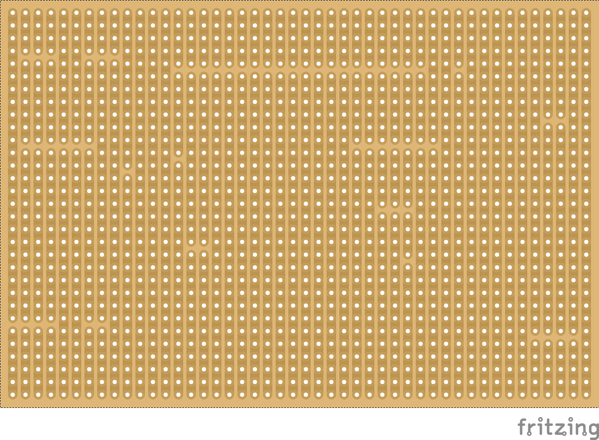
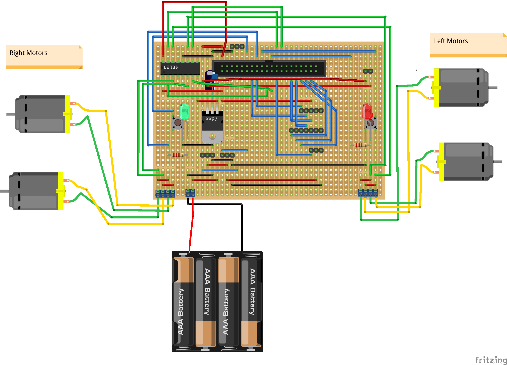
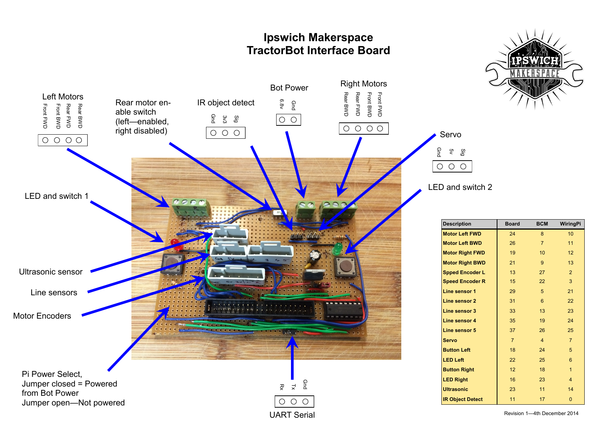

#Electronics#

##Overview##
**TractorBot** electronics is contained on a main interface board.  The interface board features the following features:

- 20 x 2 shrouded header to allow connection to the Raspberry Pi with a 40 way ribbon cable
- 5 volt low dropout voltage regulator
- L293D motor driver
- two LED's and buttons to allow selection of mode - described in the software section
- terminal connectors to conect 7.2v RC car battery
- terminal connectors to connect four motors
- jumper to connect/disconnect power to the Pi
- various headers
    - serial debug connection
    - motor encoders
    - line follower sensors
    - ultra sonic sensor
    - IR object detection sensor
    - servo
    
We have provided the following information:

- A general description on how the the robot works (below)
- Interface board map, showing the features of the board, where they are and also Raspberry Pi pin numbers
- Fritzing file and image, this is not exactly the same as the board as entered into the compitition, mainly because we found it hard to find particualar components in Fritzing. We have also omitted the swithc to disable the rear motors, we did not use this feature in the competition, the robot ran in 4WD at all times.
- We also plan to provide Ki-CAD schematics, but these have not been produced yet.

It should be noted the this documentation for the electronics has been prepared approximately nine months after the interface boards were actually made.  The board got build over a number of weeks and was not planned in advace, therefore the layout is probably not optimum.

##Interface board##
The interface board is build on strip board, when using strip board is is often necessary to break the tracks to allow a single track to be used for two signals, particually the tracks connecting the 20 x 2 header has to be broken along the centre to prevent the two rows of pins from being connected.  All the breaks can be seen in the Fritzing file, but to make it clear I have provided a image of the strip board alone.

###Fritzing Stripboard layout###
showing broken tracks

###Fritzing interface board layout###
complete with all wiring

###Interface board map###
showing header and terminal connection pin outs

[Fritzing file](TractorBot.fzz), note this has been produced after the process of making the actual stripboard, I have done a thorough review to ensure as far as possible that it is correct but there may be a mistake which has been missed.  Please check carefully yourself before use.  I do not take any responsibility for a damaged Pi as a result of using this file.