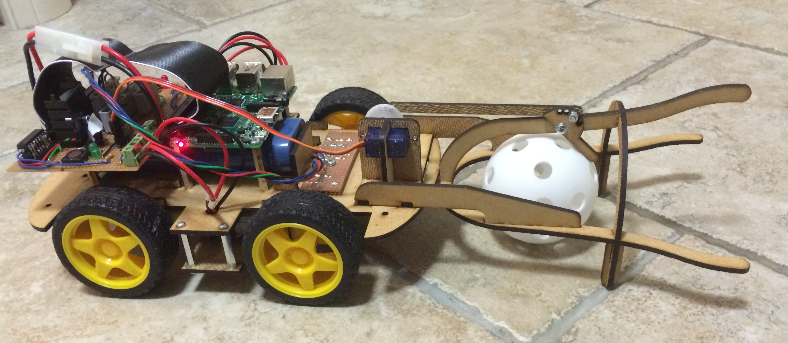
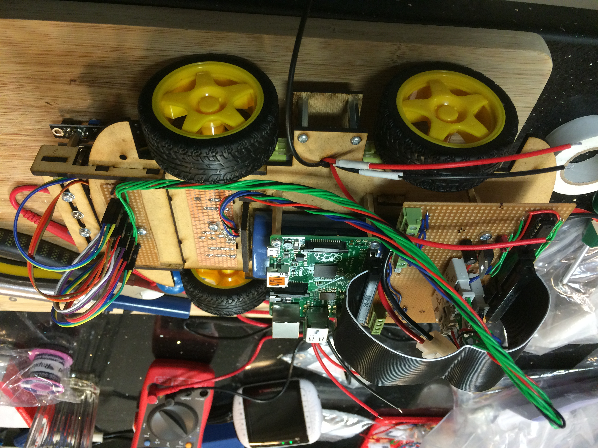
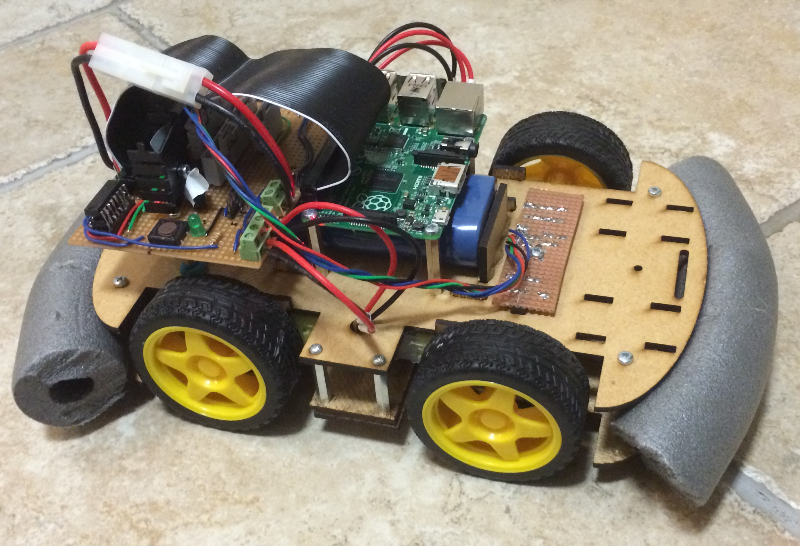

#Hardware#

##General Description##
TractorBot was designed to be cheap, we competed in the £75 and under catergory, and we were very honest with out pricing.  As a result we built our own interface board [see electronics](../electronics/electronics.md), and designed and lasercut our own chassis.

The chassis was a simple design and consists of a single plate with four cheap motors attached to the plate with 'T' connection brackets.  We were always keen to do well in the obstacle course challege so we went with four wheel drive and kept the ground clearance as high as possible.  To aid the ground clearance we did not install a second plate beaneath the motors, insteade installed a small strengthening plate between the four wheels.

The image below shows TractorBot during development. 

You can see the main plate, with the small strenghening plate below betwen the wheels, this was installed on 25mm long stand-offs.  On top of the plate there is a standard radio controlled car battery, which runs at 7.2v, the Raspoberry Pi was installed above the battery on stand-offs.  At the front we developed a universal mount system which allowed us to add and remove various sensors or attachments to suit each challenge.

The attachments we made are as follows:

* Ultrasonic sensor mount, we also mounted an IR distance sensor on this too.  Both for the proximity challenge

* Ball catcher, for the golf challenge

* Line following sensors, for the line following challenge

* Sumo suit, for the Sumo challenge

